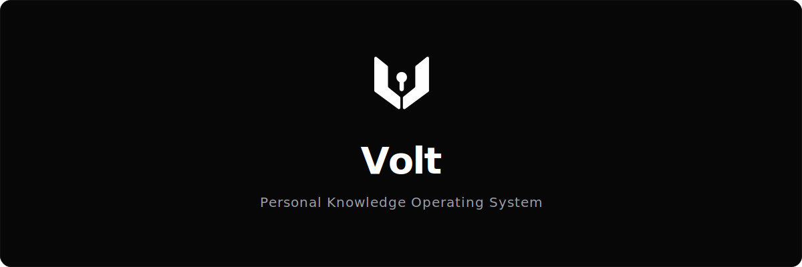

<p align="center">
  
</p>

<p align="center">
  <a href="https://github.com/shammashassan/volt/stargazers"></a>
  <a href="https://github.com/shammashassan/volt/commits/master"></a>
  <a href="https://github.com/shammashassan/volt/pulls"></a>
  <a href="https://github.com/shammashassan/volt/blob/master/LICENSE"></a>
</p>

> ⚠️ Volt is currently under active development. Features and APIs may change between releases.

---

## 🚀 About Volt

Volt is a **personal knowledge operating system** built for developers, design engineers, and curators. Traditional bookmarking systems let you hoard forgotten links; Volt shifts the focus to active curation—capturing context, establishing bidirectional links, detailing *why* items matter, and structuring custom structures matching your mental model.

Open your workspace, summon the Command Center with `Ctrl + K`, and instantly retrieve or link your digital resources.

---

## ✨ Features

- 🖥️ **Command Center Navigation**: Seamlessly navigate and search your entire digital workspace in milliseconds (`Ctrl + K`).
- 🕸️ **Interactive Knowledge Graph**: Visualize your second brain nodes using a dynamic, interactive Force Graph. Features viewport-fixed hover card tooltips, instant filter controls, and click-to-navigate client routing.
- 📶 **PWA Offline Mode & Share Target**: Install Volt as a standalone app on iOS or Android. Intercept shared links directly from other apps via the OS Share Sheet, auto-save links to your Inbox, and edit tags instantly while offline with automatic caching.
- 📁 **Structured Curation**: Save, organize, and group bookmarks and articles into custom **Categories & Collections**.
- 📝 **Bidirectional Linking**: Link **Resources** to custom **Projects**, **Notes**, and **People** to map relationships and map your second brain.
- 🎬 **Media Watchlist**: Track movies, series, and anime with real-time **TMDb** & **AniList** search integration and visual popover slider ratings.
- 📱 **Mobile Touch Optimization**: State-driven tap gestures separate preview activation from action triggers on mobile, avoiding clunky desktop hover bugs.
- 🛡️ **Multi-Tenant Security**: Private, authenticated user workspaces powered by **Better Auth**.

---

## 🛠️ Tech Stack

Volt is built with a premium, state-of-the-art developer stack:

- **Framework**: [Next.js 16 (App Router)](https://nextjs.org/) with Server Components (RSC)
- **Styling**: [Tailwind CSS v4](https://tailwindcss.com/) & [shadcn/ui](https://ui.shadcn.com/)
- **Database**: [MongoDB](https://www.mongodb.com/) (Mongoose schemas with index optimizations)
- **Authentication**: [Better Auth](https://www.better-auth.com/)
- **Animations**: [GSAP](https://gsap.com/) & [Lenis Smooth Scroll](https://lenis.darkroom.engineering/)
---

## 📈 Activity & Stars


---

## ⚡ Getting Started

### 1. Prerequisites
Ensure you have Node.js (v18+) and MongoDB installed locally or a MongoDB Atlas URI ready.

### 2. Environment Setup
Create a `.env` file in the root of the project and populate the following keys:

```env
# Database
MONGODB_URI=your_mongodb_connection_string

# Better Auth Configuration
BETTER_AUTH_SECRET=your_auth_secret
BETTER_AUTH_URL=http://localhost:3000

# Client App URL (Required for client-side authentication redirects & API configuration)
NEXT_PUBLIC_APP_URL=http://localhost:3000

# Media Watchlist API Keys (Optional - for TMDb integration)
TMDB_API_KEY=your_tmdb_api_key
TMDB_READ_TOKEN=your_tmdb_read_token

# Upstash QStash (Required for background job scheduling & webhook verification)
QSTASH_URL=https://qstash-us-east-1.upstash.io
QSTASH_TOKEN=your_qstash_token
QSTASH_CURRENT_SIGNING_KEY=your_qstash_current_signing_key
QSTASH_NEXT_SIGNING_KEY=your_qstash_next_signing_key
```

### 3. Installation
Install dependencies and run the local development server:

```bash
# Install dependencies
npm install

# Run the dev server
npm run dev
```

Open [http://localhost:3000](http://localhost:3000) in your browser.

---

## 🔌 Quick Save Extension & Bookmarklet

Volt provides tools to capture links directly from your web browser into your workspace.

### 1. Browser Extension (Dropdown Popup)
Volt comes with a native Chrome Extension that displays a clean dropdown form right under the browser toolbar.

#### Installation:
1. Open Google Chrome and navigate to `chrome://extensions/`.
2. Enable **Developer mode** (toggle in the top-right corner).
3. Click **Load unpacked** (top-left).
4. Select the `chrome-extension` directory located in the root of your cloned Volt repository (`/chrome-extension`).
5. *Note: If your Volt app is deployed to production, open `chrome-extension/popup.js` and replace `http://localhost:3000` with your production URL.*
   *Tip: To keep your local Git workspace clean, you can copy the `/chrome-extension` directory to a folder outside the project (e.g. to your Desktop) and load that copy into Chrome. This lets you point it to your production URL without triggering local Git modifications.*

#### Set a Keyboard Shortcut:
1. Navigate to `chrome://extensions/shortcuts`.
2. Locate **Volt Quick Save**.
3. Under **Activate the extension**, assign your preferred shortcut (e.g., `Ctrl + Shift + S` or `Alt + V`).

*Note: Since the extension runs over iframe contexts, make sure to log out and log back in at `http://localhost:3000` (or your production URL) to refresh the session cookies with the updated SameSite policy.*

---

### 2. Browser Bookmarklet
If you prefer not to load an unpacked extension, you can create a simple bookmarklet button on your bookmark bar.

#### Installation:
1. Right-click your browser's Bookmarks Bar and select **Add Page...** (or **Add Bookmark...**).
2. Name it `⚡ Save to Volt`.
3. Paste the following JavaScript code into the **URL / Location** field:
   ```javascript
   javascript:(function(){var url=encodeURIComponent(window.location.href);var title=encodeURIComponent(document.title);var voltUrl='http://localhost:3000/quick-save?url='+url+'&title='+title;window.open(voltUrl,'VoltQuickSave','width=450,height=680,scrollbars=yes,resizable=yes,status=no,location=no,toolbar=no,menubar=no');})();
   ```
4. Click **Save**. Now, clicking this bookmark on any page will open a quick-save popup window!
5. *Note: If your Volt app is deployed to production, make sure to replace `http://localhost:3000` in the script with your production URL.*

---

## 🔑 Keyboard Shortcuts

| Shortcut | Action |
|----------|--------|
| `Ctrl + K` or `⌘ + K` | Toggle Global Command Center (Search categories, notes, projects) |
| `Ctrl + M` or `⌘ + M` | Open Media Watchlist Search Dialog (TMDb / AniList proxy) |
| `Esc` | Close active dialog / popover |

---

## 📄 License

This project is licensed under the Apache License 2.0. See the [LICENSE](LICENSE) file for details.

---

<p align="center">
  <sub>Volt • Built with ❤️ for design engineers and curators.</sub>
</p>
